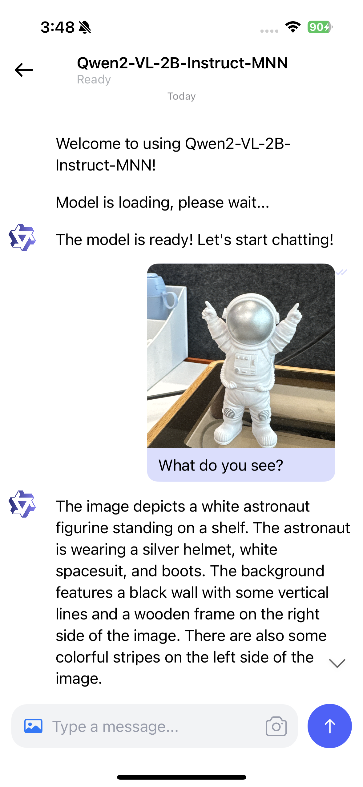

# MNNLLM iOS Application

## 介绍

本项目是一个基于MNN引擎，支持本地大模型多模态对话的iOS应用。

纯本地运行，隐私性强。当模型下载到本地之后，所有的对话都将在本地进行，不会有任何网络上传处理。

[03/12/2025] 新增：

- 支持 Modeler 源进行下载
- 支持 Stable Diffusion 文生图

|  |  |

[02/20/2025]新增：

- 支持配置mmap和手动缓存清理

- 支持使用 ModelScope 源进行模型下载

|  |  |


## 功能：

1. 模型列表
    - 获取 MNN 支持的模型礼拜；
    - 模型管理，支持下载和删除模型；
        - 支持切换 Hugging Face 和 ModelScope 源
    - 模型搜索，支持本地模型搜索；
2. 多模态聊天对话：支持完整的Markdown格式输出，支持配置mmap
    - 文本到文本
    - 语音到文本
    - 图片到文本，图片可以拍摄输入或从图库中选择
3. 对话历史
    - 包含对话历史列表，可以还原对话场景

### 视频介绍


[点击这里下载原分辨率介绍视频](https://github.com/Yogayu/MNN/blob/master/project/MNNLLMForiOS/assets/introduction.mov)

### 应用预览图

|  |  |  |
|--|--|--|
| **Text To Text**  | **Image To Text**  | **Audio To Text**  |
|  |  |  |
| **Model List**  | **History**  | **History**  |
|  |  |  |


<p></p>

此外，本应用支持 DeepSeek  带think模式端侧使用：


## 如何构建并使用

1. 下载仓库代码：

    ```shell
    git clone https://github.com/alibaba/MNN.git
    ```

2. 编译 MNN.framework:

    ```shell
    cd MNN/
    sh package_scripts/ios/buildiOS.sh "-DMNN_ARM82=true -DMNN_LOW_MEMORY=true -DMNN_SUPPORT_TRANSFORMER_FUSE=true -DMNN_BUILD_LLM=true -DMNN_CPU_WEIGHT_DEQUANT_GEMM=true
    -DMNN_METAL=ON
    -DMNN_BUILD_DIFFUSION=ON
    -DMNN_BUILD_OPENCV=ON
    -DMNN_IMGCODECS=ON
    -DMNN_OPENCL=OFF
    -DMNN_SEP_BUILD=OFF
    -DMNN_SUPPORT_TRANSFORMER_FUSE=ON"
    ```

3. 拷贝 framework 到 iOS 项目中

    ```shell
    mv MNN-iOS-CPU-GPU/Static/MNN.framework apps/iOS/MNNLLMChat
    ```

    确保 Link Binary With Libraried 中包含 MNN.framework，和其他三个 Framework。

    

    如果没有包含，可以手动添加 MNN.framework:

    
    


4. 修改 iOS 签名并编译项目

    ```shell
    cd apps/iOS/MNNLLMChat
    open MNNLLMiOS.xcodeproj
    ```

    在 Xcode 项目属性中 Signing & Capabilities > Team 输入自己的账号和Bundle Identifier

    


    等待 Swift Package 下载完成之后，进行编译使用。

## 注意

iPhone 因为内存有限，建议使用7B以及以下的模型，避免内存不足导致的崩溃。


## 本地调试

如果我们希望直接电脑下载模型，不通过App内下载模型，进行调试，可以通过一下的方式。

1. 首先在 [huggingface](https://huggingface.co/taobao-mnn) 或者 [modelscope](https://modelscope.cn/organization/MNN) 下载 MNN 相关的模型

    


2. 将下载之后的模型文件夹内的所有文件，拖动到项目中 LocalModel 文件夹下：

    


3. 确保以上文件都已经在 copy bundle resources 中


    


4. 注释下载相关代码

    ```Swift
    /*
    try await modelClient.downloadModel(model: model) { progress in
        Task { @MainActor in
            DispatchQueue.main.async {
                self.downloadProgress[model.modelId] = progress
            }
        }
    }
    */
    ```
5. 修改模型加载方式

    在 LLMInferenceEngineWrapper 类中修改：

    ```Swift
    // BOOL success = [self loadModelFromPath:modelPath];
    // MARK: Test Local Model
    BOOL success = [self loadModel];
    ```

6. 运行项目，点击进入聊天对话页面，进行模型对话和调试。


## 引用

- [Exyte/Chat](https://github.com/exyte/Chat)
- [stephencelis/CSQLite](https://github.com/stephencelis/SQLite.swift)
- [swift-transformers](https://github.com/huggingface/swift-transformers/)