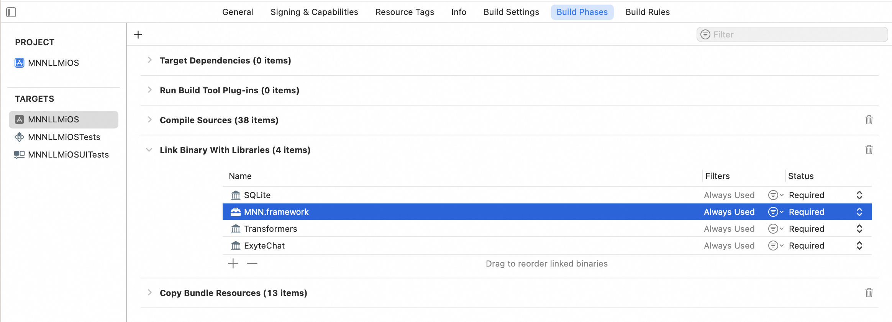

# MNNLLM iOS Application

[查看中文文档](./README-ZH.md)

## Introduction

This project is an iOS application based on the MNN engine, supporting local large models and multi-modal conversations.

It operates entirely offline, ensuring strong privacy. Once the model is downloaded locally, all dialogues will be processed locally without any network uploads.

## Features

1. **Model Management**
    - Get a list of models supported by MNN.
    - Support for downloading and deleting models.
    - Local model search support.

2. **Multi-modal Conversations**
    - **Text to Text**: Engage in text-based dialogues.
    - **Speech to Text**: Convert speech input into text for dialogue.
    - **Image to Text**: Take or select an image from the gallery and get a textual description.

3. **Conversation History**
    - View historical dialogues and restore conversation scenes.

### Application Preview


<div style="display: flex; justify-content: center; align-items: center; text-align: center; width: 100%;">

<div style="flex: 0 0 20%; display: flex; flex-direction: column; align-items: center;">
<p style="margin: 0; font-weight: bold;">Text To Text</p>

</div>

<div style="flex: 0 0 20%; display: flex; flex-direction: column; align-items: center;">
<p style="margin: 0; font-weight: bold;">Image To Text</p>

</div>

<div style="flex: 0 0 20%; display: flex; flex-direction: column; align-items: center;">
<p style="margin: 0; font-weight: bold;">Audio To Text</p>

</div>

</div>

<div style="display: flex; justify-content: center; align-items: center; text-align: center; width: 100%;">

<div style="flex: 0 0 20%; display: flex; flex-direction: column; align-items: center;">
<p style="margin: 0; font-weight: bold;">Model List</p>

</div>

<div style="flex: 0 0 20%; display: flex; flex-direction: column; align-items: center;">
<p style="margin: 0; font-weight: bold;">History</p>

</div>

<div style="flex: 0 0 20%; display: flex; flex-direction: column; align-items: center;">
<p style="margin: 0; font-weight: bold;">History</p>

</div>

</div>


## How to Build and Use

### 1. Clone the Repository:

    ```shell
    git clone https://github.com/alibaba/MNN.git
    ```

### 2. Build MNN.framework:

    ```shell
    cd MNN/
    sh package_scripts/ios/buildiOS.sh "-DMNN_ARM82=true -DMNN_LOW_MEMORY=true -DMNN_SUPPORT_TRANSFORMER_FUSE=true -DMNN_BUILD_LLM=true -DMNN_CPU_WEIGHT_DEQUANT_GEMM=true
    -DMNN_METAL=ON
    -DMNN_BUILD_DIFFUSION=ON
    -DMNN_BUILD_OPENCV=ON
    -DMNN_IMGCODECS=ON
    -DMNN_OPENCL=OFF
    -DMNN_SEP_BUILD=OFF
    -DMNN_SUPPORT_TRANSFORMER_FUSE=ON"
    ```

### 3. Copy the Framework into Your iOS Project:

    ```shell
    mv MNN-iOS-CPU-GPU/Static/MNN.framework transformers/llm/engine/ios/MNN.framework
    project/ios/MNNLLMForiOS/MNN.framework
    ```

    Ensure that `MNN.framework` and other three libraries are included in the **Link Binary With Libraries** section.
    
    

    If it's missing, you can add `MNN.framework` manually:

    

    

### 4. Modify iOS Signing and Build the Project:

    ```shell
    cd project/ios/MNNLLMForiOS
    open MNNLLMiOS.xcodeproj
    ```

    In the Xcode project properties, go to **Signing & Capabilities** > **Team** and enter your account and Bundle Identifier:

    

    Wait for the Swift Package to finish downloading, then build and use the project.

## Notes

Due to limited memory on iPhones, it is recommended to use models of size 7B or smaller to avoid crashes caused by insufficient memory.

## References

- [Exyte/Chat](https://github.com/exyte/Chat)
- [stephencelis/CSQLite](https://github.com/stephencelis/SQLite.swift)
